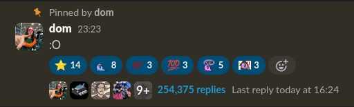

# spambot: growing HC's largest thread

<p align="center">
  
</p>

To install dependencies:

```bash
bun install
```

To run:

```bash
bun run index.ts
```

You will need to make a slack app at [api.slack.com](https://api.slack.com/apps) with the below app manifest
```yaml
display_information:
  name: The super spammer
oauth_config:
  scopes:
    user:
      - chat:write
settings:
  org_deploy_enabled: false
  socket_mode_enabled: false
  token_rotation_enabled: false
```

make a `.env` file containing the slack token and signing secret

```bash
SLACK_TOKEN=xoxp-xxxx
SLACK_SIGNING_SECRET=xxxxx
```

This project was created using `bun init` in bun v1.1.20. [Bun](https://bun.sh) is a fast all-in-one JavaScript runtime.
